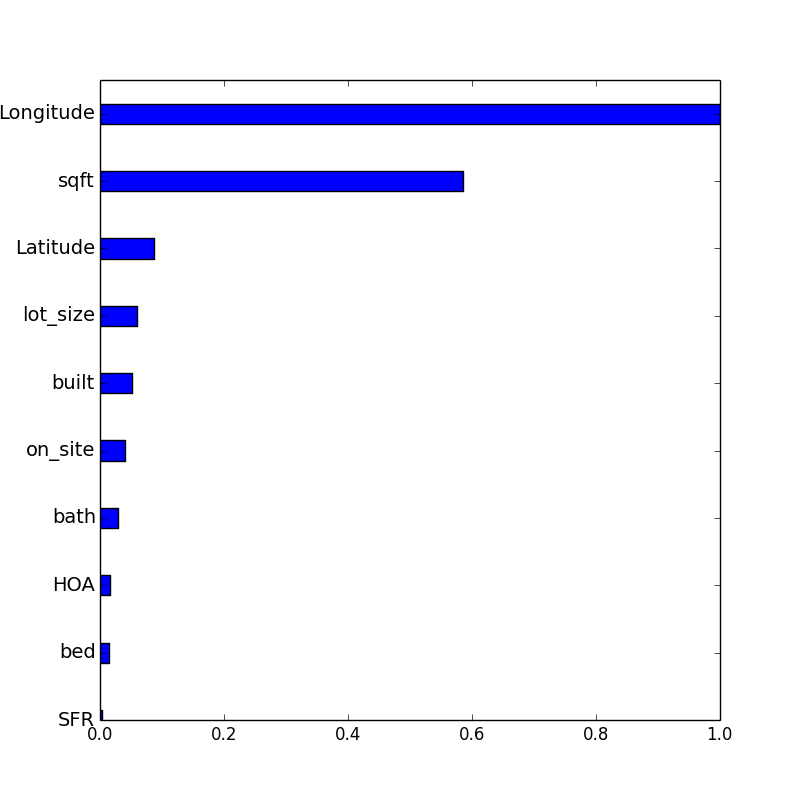
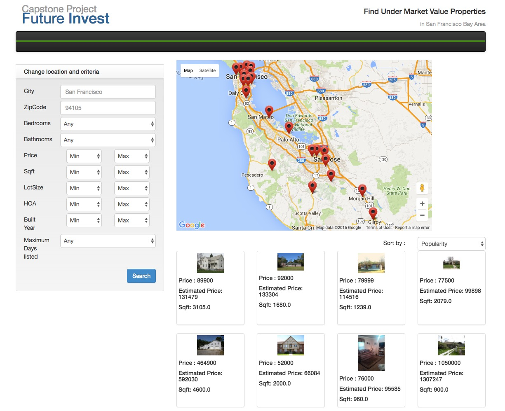

# FutureInvest
Eric Bai

05/04/2016

Future Invest: Find best under market value properties

Reason:

It is very time consuming when researching the market in order to make a knowledgable investment into real estate. There is no good analysing tool to help people easily find under valued properties. 

Data Pipeline and Modeling Steps

1. scrapped the property information on ziprealty.
2. Select about 15 important features to fit into the model. Here is a summary of most important features. Location and size are the two most important features.

3. Ran a random forest model with selected features with cross validation to find best parameters
4. Returned estimated market prices for all properties in the San Francisco Bay area
5. Created a web app for user to be able to use this tool

Next steps:

1. Get data from the whole US
2. Find other possible important features
3. Include photos as features with nerual network because people can tell if the property is good or not based on pictures
4. Create a mobile app
